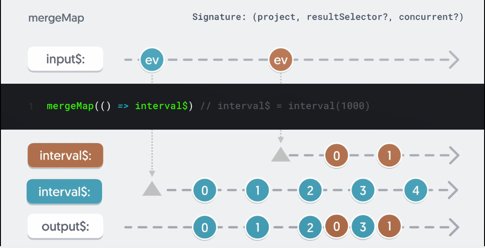

# What is a flattening operator

- Flattening operators take an observable that emit an observable and subscribe to it internally and emit the results to the outer stream

  ```js
  import { map, debounceTime, fromEvent } from "rxjs";
  import { ajax } from "rxjs/ajax";

  const textInput = document.querySelector("text-input");

  const input$ = fromEvent(textInput, "keyup");

  input$
    .pipe(
      debounceTime(1000),
      map((event) => {
        const term = event.target.value;
        return ajax.getJSON(`https://api.github.com/users/${term}`);
      })
    )
    .subscribe(console.log);
  ```

- in the above example, we don't see the response from the api request rather we see the ajax observervable that is being returned from the map. to fix the we have to subscibe to the observervable that we receive from the map inside the subscribe method:

  ```js
  import { map, debounceTime, fromEvent } from "rxjs";
  import { ajax } from "rxjs/ajax";

  const textInput = document.querySelector("text-input");

  const input$ = fromEvent(textInput, "keyup");

  input$
    .pipe(
      debounceTime(1000),
      map((event) => {
        const term = event.target.value;
        return ajax.getJSON(`https://api.github.com/users/${term}`);
      })
    )
    .subscribe((obs) => {
      obs.subscribe(console.log);
    });
  ```

- and if we needed to transform the resulting observable we would need to use pipe inside the subscription:

  ```js
  import { map, debounceTime, fromEvent } from "rxjs";
  import { ajax } from "rxjs/ajax";

  const textInput = document.querySelector("text-input");

  const input$ = fromEvent(textInput, "keyup");

  input$
    .pipe(
      debounceTime(1000),
      map((event) => {
        const term = event.target.value;
        return ajax.getJSON(`https://api.github.com/users/${term}`);
      })
    )
    .subscribe((obs) => {
      obs.pipe().subscribe(console.log);
    });
  ```

- looks complicated, isn't it? we can use a flattening operator to solve this issue

  ```js
  import { map, debounceTime, fromEvent, mergeAll } from "rxjs";
  import { ajax } from "rxjs/ajax";

  const textInput = document.querySelector("text-input");

  const input$ = fromEvent(textInput, "keyup");

  input$
    .pipe(
      debounceTime(1000),
      map((event) => {
        const term = event.target.value;
        return ajax.getJSON(`https://api.github.com/users/${term}`);
      }),
      mergeAll()
    )
    .subscribe(console.log);
  ```

- when `mergeAll` receives an observable from the source, it subscribes internally emitting any results emitted by that observable. In this case, it'll subscribe to the ajax observable and emit the response

- the above code can be further shortened using `mergeMap` operator that functions similarly to map and mergeAll together

  ```js
  import { map, debounceTime, fromEvent, mergeMap } from "rxjs";
  import { ajax } from "rxjs/ajax";

  const textInput = document.querySelector("text-input");

  const input$ = fromEvent(textInput, "keyup");

  input$
    .pipe(
      debounceTime(1000),
      mergeMap((event) => {
        const term = event.target.value;
        return ajax.getJSON(`https://api.github.com/users/${term}`);
      })
    )
    .subscribe(console.log);
  ```

# mergeMap

- the `mergeMap` operator maps each value to an observable and then falttens these observables by subscribing internally, emitting the results.

- by default, `mergeMap` doesn't limit the number of active subscriptions. If the source emits another value, it is again mapped to an observable and a second inner subscription is created. Whenever an inner active observable emits a value, that value is emitted by `mergeMap`.

  ```js
  import { fromEvent, interval, mergeMap } from "rxjs";

  const click$ = fromEvent(document, "click");
  const interval$ = interval(1000);

  click$.pipe(mergeMap(interval$)).subscribe(console.log);
  ```

- the issue with above implementation is that since `mergeMap` doesn't have a limit on inner observable, every time we click, a new interval starts.

- to fix the above issue, we can use `takeUntil` operator in conjuntion with `mergeMap`

  ```js
  import { fromEvent, interval, mergeMap, takeUntil } from "rxjs";

  const mouseDown$ = fromEvent(document, "mousedown");
  const mouseUp$ = fromEvent(document, "mouseup");
  const interval$ = interval(1000);

  mouseDown$
    .pipe(mergeMap(() => interval$.pipe(takeUntil(mouseUp$))))
    .subscribe(console.log);
  ```

- a particular use case would be http requests - particularly saves

- In summary, `mergeMap` maps values to a new observable on emissions from source, subscribing to and emitting results of inner observable. By default, `mergeMap` doesn't limit the number of active inner observables.

- Useful for http requests you don't want cancelled, such as POSTs or inner observables whose lifetime you'll manage using `take` or `takeUntil`. Remember to clean up inner observables to prevent memory leaks and unintended consequences.

- 
