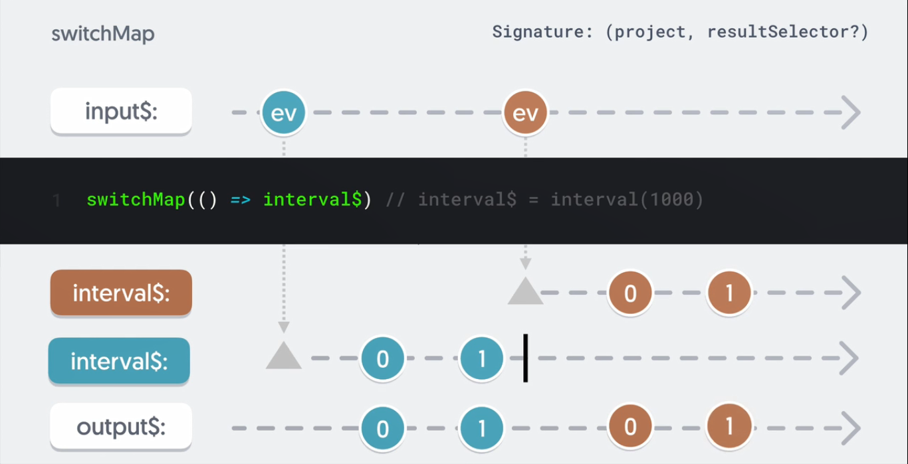
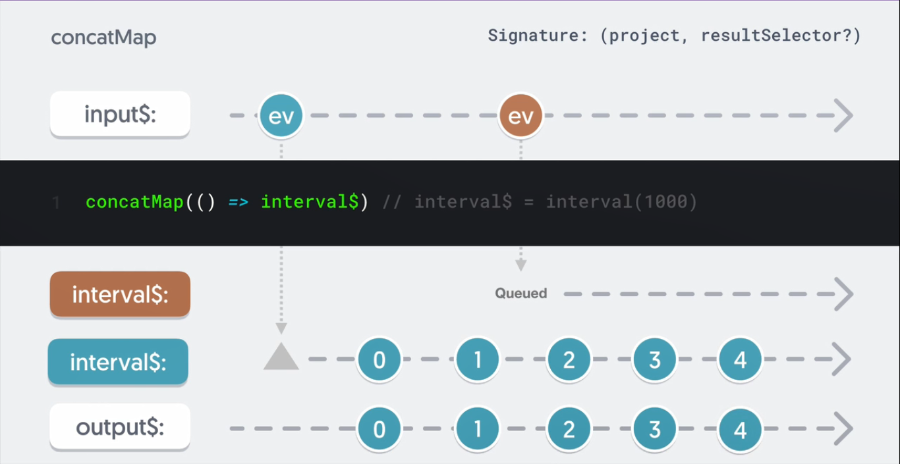
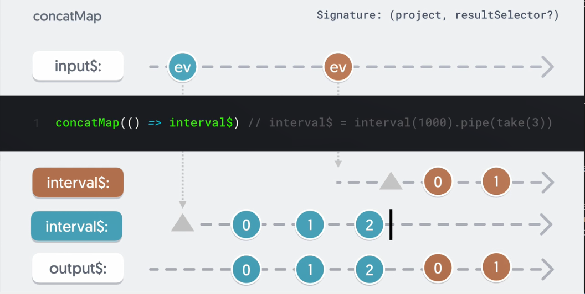
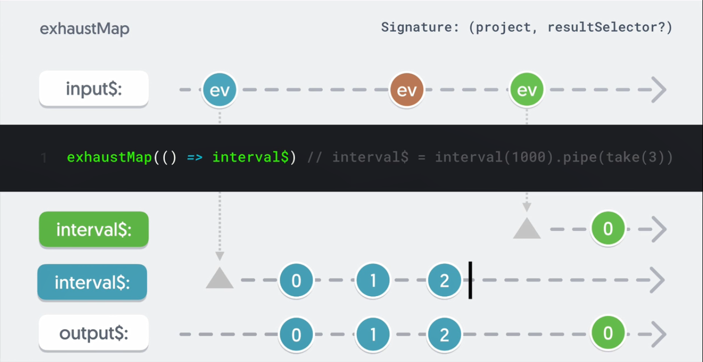
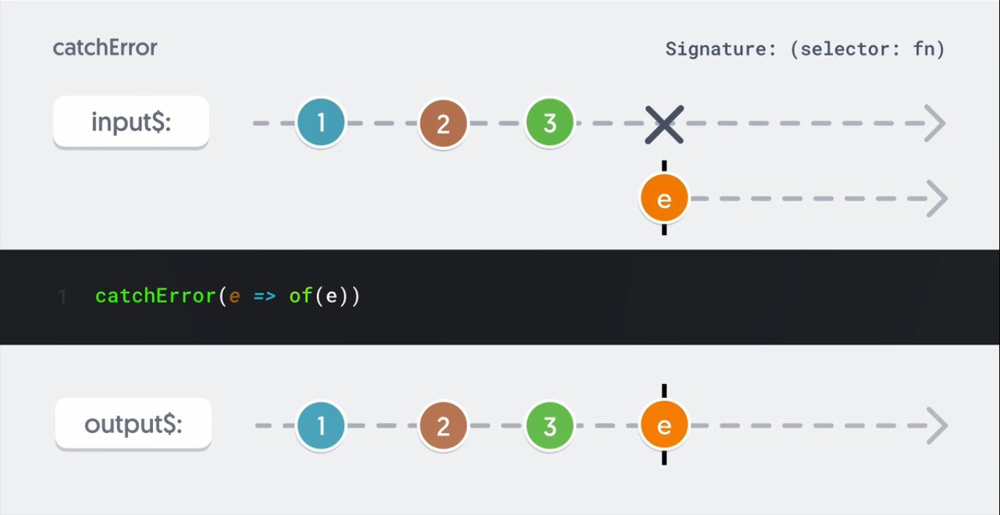

# What is a flattening operator

- Flattening operators take an observable that emit an observable and subscribe to it internally and emit the results to the outer stream

  ```js
  import { map, debounceTime, fromEvent } from "rxjs";
  import { ajax } from "rxjs/ajax";

  const textInput = document.querySelector("text-input");

  const input$ = fromEvent(textInput, "keyup");

  input$
    .pipe(
      debounceTime(1000),
      map((event) => {
        const term = event.target.value;
        return ajax.getJSON(`https://api.github.com/users/${term}`);
      })
    )
    .subscribe(console.log);
  ```

- in the above example, we don't see the response from the api request rather we see the ajax observervable that is being returned from the map. to fix the we have to subscibe to the observervable that we receive from the map inside the subscribe method:

  ```js
  import { map, debounceTime, fromEvent } from "rxjs";
  import { ajax } from "rxjs/ajax";

  const textInput = document.querySelector("text-input");

  const input$ = fromEvent(textInput, "keyup");

  input$
    .pipe(
      debounceTime(1000),
      map((event) => {
        const term = event.target.value;
        return ajax.getJSON(`https://api.github.com/users/${term}`);
      })
    )
    .subscribe((obs) => {
      obs.subscribe(console.log);
    });
  ```

- and if we needed to transform the resulting observable we would need to use pipe inside the subscription:

  ```js
  import { map, debounceTime, fromEvent } from "rxjs";
  import { ajax } from "rxjs/ajax";

  const textInput = document.querySelector("text-input");

  const input$ = fromEvent(textInput, "keyup");

  input$
    .pipe(
      debounceTime(1000),
      map((event) => {
        const term = event.target.value;
        return ajax.getJSON(`https://api.github.com/users/${term}`);
      })
    )
    .subscribe((obs) => {
      obs.pipe().subscribe(console.log);
    });
  ```

- looks complicated, isn't it? we can use a flattening operator to solve this issue

  ```js
  import { map, debounceTime, fromEvent, mergeAll } from "rxjs";
  import { ajax } from "rxjs/ajax";

  const textInput = document.querySelector("text-input");

  const input$ = fromEvent(textInput, "keyup");

  input$
    .pipe(
      debounceTime(1000),
      map((event) => {
        const term = event.target.value;
        return ajax.getJSON(`https://api.github.com/users/${term}`);
      }),
      mergeAll()
    )
    .subscribe(console.log);
  ```

- when `mergeAll` receives an observable from the source, it subscribes internally emitting any results emitted by that observable. In this case, it'll subscribe to the ajax observable and emit the response

- the above code can be further shortened using `mergeMap` operator that functions similarly to map and mergeAll together

  ```js
  import { map, debounceTime, fromEvent, mergeMap } from "rxjs";
  import { ajax } from "rxjs/ajax";

  const textInput = document.querySelector("text-input");

  const input$ = fromEvent(textInput, "keyup");

  input$
    .pipe(
      debounceTime(1000),
      mergeMap((event) => {
        const term = event.target.value;
        return ajax.getJSON(`https://api.github.com/users/${term}`);
      })
    )
    .subscribe(console.log);
  ```

# mergeMap

- the `mergeMap` operator maps each value to an observable and then falttens these observables by subscribing internally, emitting the results.

- by default, `mergeMap` doesn't limit the number of active subscriptions. If the source emits another value, it is again mapped to an observable and a second inner subscription is created. Whenever an inner active observable emits a value, that value is emitted by `mergeMap`.

  ```js
  import { fromEvent, interval, mergeMap } from "rxjs";

  const click$ = fromEvent(document, "click");
  const interval$ = interval(1000);

  click$.pipe(mergeMap(interval$)).subscribe(console.log);
  ```

- the issue with above implementation is that since `mergeMap` doesn't have a limit on inner observable, every time we click, a new interval starts.

- to fix the above issue, we can use `takeUntil` operator in conjuntion with `mergeMap`

  ```js
  import { fromEvent, interval, mergeMap, takeUntil } from "rxjs";

  const mouseDown$ = fromEvent(document, "mousedown");
  const mouseUp$ = fromEvent(document, "mouseup");
  const interval$ = interval(1000);

  mouseDown$
    .pipe(mergeMap(() => interval$.pipe(takeUntil(mouseUp$))))
    .subscribe(console.log);
  ```

  ```html
  <!DOCTYPE html>
  <html lang="en">
    <head>
      <meta charset="UTF-8" />
      <meta name="viewport" content="width=device-width, initial-scale=1.0" />
      <title>Document</title>
      <link rel="stylesheet" href="./style.css" />
    </head>
    <body>
      <input type="text" id="ipt-1" placeholder="type your text" />
      <input type="text" id="ipt-2" placeholder="type your text" /> <br />
      <p class="entered-text"></p>
      <script src="./script.js"></script>
    </body>
  </html>
  ```

  ```js
  import { fromEvent, map, mergeMap, debounceTime, pluck } from "rxjs";

  const input1 = document.querySelector("#ipt-1");
  const input2 = document.querySelector("#ipt-2");
  const enteredText = document.querySelector(".entered-text");

  const source1$ = fromEvent(input1, "keyup").pipe(debounceTime(200));
  const source2$ = fromEvent(input2, "keyup").pipe(debounceTime(200));

  source1$
    .pipe(
      pluck("target", "value"),
      mergeMap((val1) => {
        return source2$.pipe(
          pluck("target", "value"),
          map((val2) => ({ val1, val2 }))
        );
      })
    )
    .subscribe((value) => {
      enteredText.innerText = `${value.val1} ${value.val2}`;
    });
  ```

- a particular use case would be http requests - particularly saves

- In summary, `mergeMap` maps values to a new observable on emissions from source, subscribing to and emitting results of inner observable. By default, `mergeMap` doesn't limit the number of active inner observables.

- Useful for http requests you don't want cancelled, such as POSTs or inner observables whose lifetime you'll manage using `take` or `takeUntil`. Remember to clean up inner observables to prevent memory leaks and unintended consequences.

- 

# switchMap

- the `switchMap` operator maps each value to an observable and then flattens that observable. unlike `mergeMap`, `switchMap` maintains one active inner subscription at a time, so anytime we map to a new inner observable, the previous one is completed.

  ```html
  <!DOCTYPE html>
  <html lang="en">
    <head>
      <meta charset="UTF-8" />
      <meta name="viewport" content="width=device-width, initial-scale=1.0" />
      <title>Document</title>
    </head>
    <body>
      <input type="text" placeholder="type here" id="text-input" /> <br />
      <div class="container" style="color: white"></div>
      <script src="./script.js"></script>
    </body>
  </html>
  ```

  ```js
  import {
    fromEvent,
    switchMap,
    debounceTime,
    pluck,
    distinctUntilChanged,
  } from "rxjs";
  import { ajax } from "rxjs/ajax";

  const URL = "https://api.openbrewerydb.org/breweries/";
  const container = document.querySelector(".container");
  const inputBox = document.querySelector("#text-input");

  const source$ = fromEvent(inputBox, "keyup");

  source$
    .pipe(
      debounceTime(200),
      pluck("target", "value"),
      distinctUntilChanged(),
      switchMap((term) => ajax.getJSON(`${URL}?by_name=${term}`))
    )
    .subscribe(
      (res) => (container.innerHTML = res.map((b) => b.name).join("<br>"))
    );
  ```



- in summary, `switchMap` swithces to a new observable on emissions from source, cancelling any previous active inner observables.

- safest default for flattening, hard to create leaks like `mergeMap`

- useful for http requests that can be cancelled (GET requests), great for reset, pause and resume functionality.

- avoid `switchMap` when cancellation could have undesired effects such as saves (POST)

# concatMap

- `concatMap` operator acts similarly as `switchMap` and `mergeMap`, maps a value to an observable, flattening the result.

- what makes `concatMap` unique is instead of subscribing to inner observables as they arrive like `mergeMap` or switching to a new observable on each emission like `switchMap`, `concatMap` instead queues all inner observables until the previous one completes.

- `concatMap` can be used in situations where you need to maintain the order of execution and your inner observable have finite lifespans.



- the issue in the above diagram example is that, since the first inner interval never completes, no other inner observable will ever be activated.



```js
import { fromEvent, interval, concatMap } from "rxjs";

const interval$ = interval(1000);
const source$ = fromEvent(document, "click");

source$.subscribe(concatMap(interval$)).subscribe(console.log);
```

- the issue with the above example is that since the inner interval never completes, no other inner observable will ever be activated and will be queued up.

  ```js
  import { fromEvent, interval, concatMap, take } from "rxjs";

  const interval$ = interval(1000);
  const source$ = fromEvent(document, "click");

  source$.subscribe(concatMap(interval$.pipe(take(3)))).subscribe(console.log);
  ```

- `take` completes the inner interval after 3 emissions, so depending on the number of clicks, the intervals will be queued up awaiting the previous one to complete.

- uses case would be when you would want to maintain an order of request on the client rather than server

- to sum it up, `concatMap` maintains one active inner subscription, activates the next observable when previous completes. use it when the order of execution is important and inner observables have finite lifespans.

- be careful if you have long running inner observables, as subswquent mapped observables could back up or never execute at all.

# exhaustMap

- like `switchMap` and `concatMap`, `exhaustMap` only maintains one inner subscription at a time. the difference lies how it handles new values being emitted
  when an inner subscription is already active - where `switchMap` switches to the new mapped observable whereas `concatMap` queues it, `exhaustMap` throws it away.



- in the above example (and below), till the inner interval emits 3 values, any other source emissions will be ignored (clicks in this case)

  ```js
  import { fromEvent, exhaustMap, take, interval } from "rxjs";

  const source$ = fromEvent(document, "click");
  const interval$ = interval(1000);

  source$
    .pipe(exhaustMap(() => interval$.pipe(take(3))))
    .subscribe(console.log);
  ```

- one use case would be when you have an action that can be spammed and it's not productive to initiate multiple inner observables, for eg. a login form

- avoid using this operator if cancellation is important or ignoring emissions from the source would cause undesired effects (like on saves)

# catchError

- the `catchError` operator catches error in an observable source either throwing an error or returning a new observable. catching an error completes the observable so be catious where you place your `catchError` operator depending on the usecase.

  
