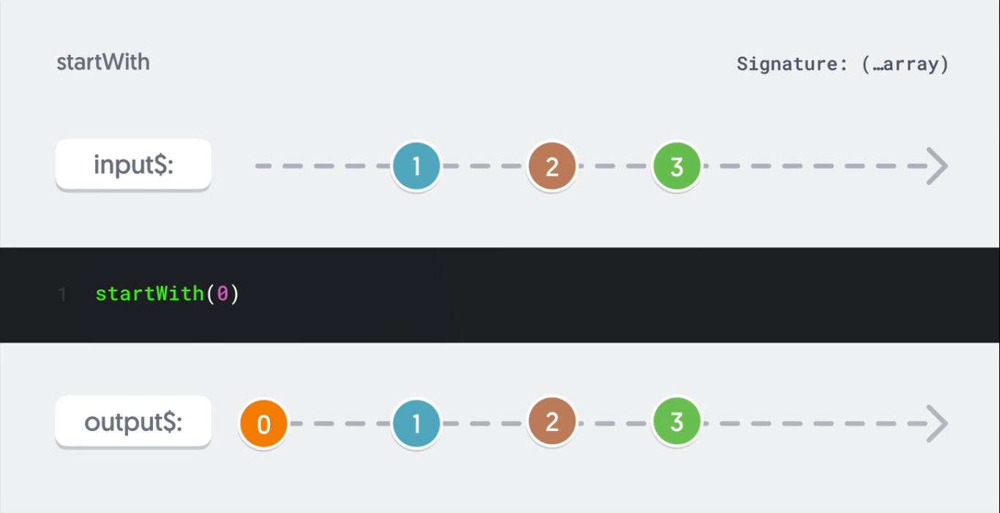
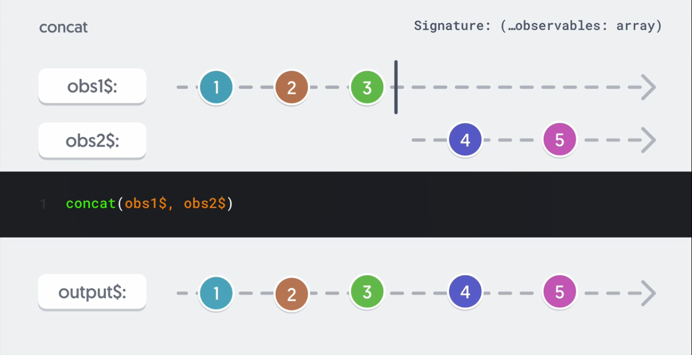
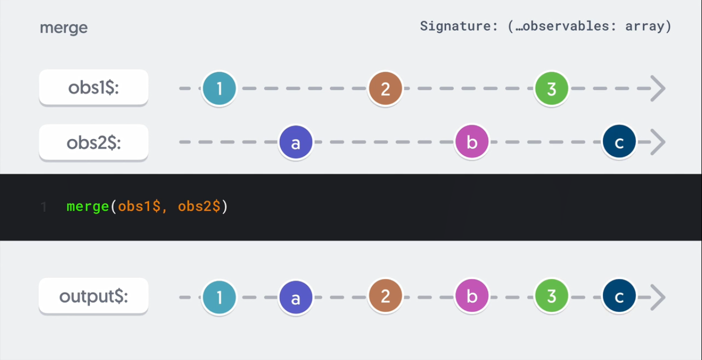
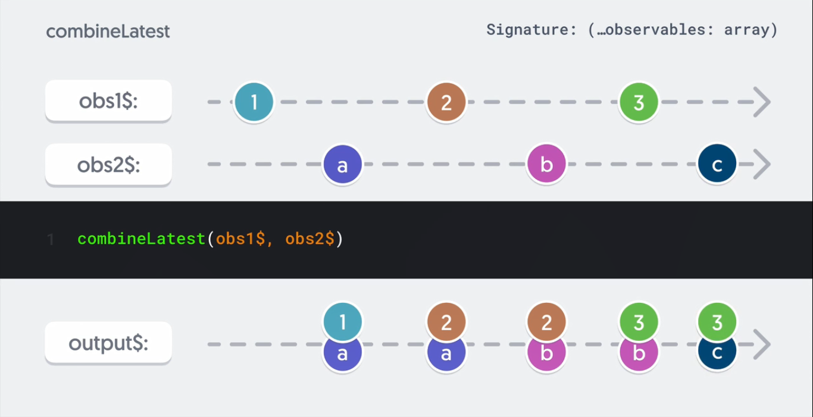
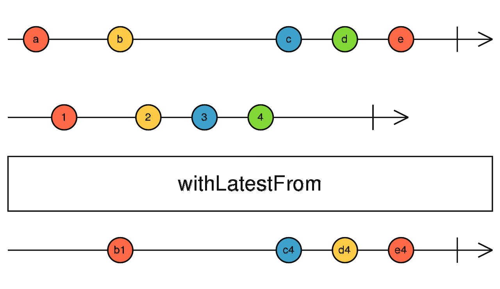
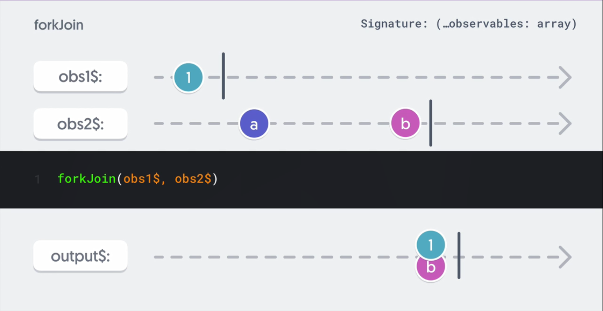

# What are combination operators

- these operators join multiple observables into a single stream (eg. combine multiple requests, perform calculations based on multiple stream inputs, tracking on values to the beginning or the end of a stream)

# startWith

- the `startWith` operator appends specified value or values to a stream emitting them first on subscription.

- In the below diagram, we are supplying a value of 0 using the startWith operator. On subscription, this value (0) will be emitted first immediately, followed by any other values emitted by the input observable.

  

  ```js
  import { of, startWith } from "rxjs";

  const num$ = of(1, 2, 3);
  num$.pipe(startWith("a", "b", "c")).subscribe(console.log); // a b c 1 2 3
  ```

  ```js
  import {
    interval,
    scan,
    map,
    fromEvent,
    takeUntil,
    takeWhile,
    startWith,
  } from "rxjs";

  const countdown = document.getElementById("countdown");
  const message = document.getElementById("message");
  const abort = document.getElementById("abort");

  const interval$ = interval(1000);
  const abortBtn$ = fromEvent(abort, "click");

  const TIMER_START = 30;

  interval$
    .pipe(
      map(() => -1),
      scan((acc, nxt) => {
        return acc + nxt;
      }, TIMER_START),
      takeWhile((val) => val >= 0),
      takeUntil(abortBtn$),
      startWith(TIMER_START)
    )
    .subscribe((val) => {
      countdown.innerText = val;
      if (!val) {
        message.innerText = "Takeoff";
      }
    });
  ```

# endWith

- the `endWith` operator appends specified value or values to the end of a stream

  ```js
  import { of, startWith, endWith } from "rxjs";

  const num$ = of(1, 2, 3);
  num$
    .pipe(startWith("a", "b", "c"), endWith("c", "d", "e"))
    .subscribe(console.log); // a b c 1 2 3 c d e
  ```

# concat

- the `concat` creation operator lets you create an observable from a variable number of other observable you supply. On subscription, `concat` will subscribe to the inner observables in order - so as the first completes, the second is subscribed to and so on.

- whenever you have multiple observables you want to execute in order, you can use `concat`

- any values emitted by the inner observables are emitted by `concat`. In the below digram example, `concat` subscribe to obs1$ first. On completion of obs1$, concat will then subscribe to obs2$ and so on if more observables were supplied.

  

  ```js
  import { startWith, concat, delay } from "rxjs/operators";
  import { EMPTY } from "rxjs";

  const delay$ = EMPTY.pipe(delay(1000));

  delay$
    .pipe(
      concat(
        delay$.pipe(startWith("3...")),
        delay$.pipe(startWith("2...")),
        delay$.pipe(startWith("1...")),
        delay$.pipe(startWith("Go..."))
      ),
      startWith("Get Ready")
    )
    .subscribe(console.log);
  ```

# merge

- `merge` creates an observable from a variable number of other observbales that you supply and on subscription, merge subscribes to all inner observables at once emitting all values emitted by these observables as they occur

  

  ```js
  import { fromEvent, merge } from "rxjs";

  const keyUp$ = fromEvent(document, "keyup");
  const click$ = fromEvent(document, "click");

  // keyUp$.subscribe(console.log)
  // click$.subscribe(console.log)

  merge(keyUp$, click$).subscribe(console.log);
  ```

  ```js
  import {
    fromEvent,
    scan,
    interval,
    merge,
    map,
    startWith,
    switchMap,
    takeWhile,
  } from "rxjs";
  import { EMPTY } from "rxjs";

  const startBtn = document.querySelector(".start");
  const stopBtn = document.querySelector(".stop");
  const countdown = document.getElementById("timer");
  const message = document.querySelector(".message");

  const START_VAL = 10;

  const interval$ = interval(1000);
  const start$ = fromEvent(startBtn, "click");
  const stop$ = fromEvent(stopBtn, "click");

  merge(start$.pipe(map(() => true)), stop$.pipe(map(() => false)))
    .pipe(
      switchMap((val) => (val ? interval$ : EMPTY)),
      map(() => -1),
      scan((acc, nxt) => {
        return acc + nxt;
      }, START_VAL),
      takeWhile((val) => val >= 0),
      startWith(START_VAL)
    )
    .subscribe((val) => {
      countdown.innerText = val;
      if (!val) {
        message.innerText = "Takeoff";
      }
    });
  ```

```html
<!DOCTYPE html>
<html lang="en">
  <head>
    <meta charset="UTF-8" />
    <meta name="viewport" content="width=device-width, initial-scale=1.0" />
    <title>Document</title>
  </head>
  <body>
    <h2 id="timer"></h2>
    <button class="start">Start</button>
    <button class="stop">Stop</button>
    <div class="message"></div>
    <script type="module" src="./script.js"></script>
  </body>
</html>
```

# combineLatest

- the `combineLatest` operator creates an observable from a variable number of other observables that are supplied. on subscription, `combineLatest` will subscribe to all inner obervables after all inner obervables have emitted atleast one value, `combineLatest` will emit the last value emitted from each inner obervable as an array on any emissions.

  

  ```js (combining input values ot two input elements)
  import { combineLatest, fromEvent } from "rxjs";
  import { map, filter } from "rxjs/operators";

  const ipt1 = document.querySelector("#ipt-1");
  const ipt2 = document.querySelector("#ipt-2");
  const results = document.querySelector(".results");

  const input1$ = fromEvent(ipt1, "keyup");
  const input2$ = fromEvent(ipt2, "keyup");

  // helpers
  const keyUpAsValue = (elem) => {
    return fromEvent(elem, "keyup").pipe(map((event) => event.target.value));
  };

  combineLatest(keyUpAsValue(ipt1), keyUpAsValue(ipt2))
    .pipe(
      filter(([val1, val2]) => val1.length && val2.length),
      map(([val1, val2]) => val1 + " " + val2)
    )
    .subscribe((val) => (results.innerText = val));
  ```

# withLatestFrom

- this operator allows you to combine the emissions of two or more observables into a single observable.

- useful when you have a primary observable whose emissions should be combined with the latest values from one or more secondary observables.

- The key characteristic of `withLatestFrom` is that it only emits a value when the primary observable emits, and it includes the latest values from the secondary observables at that time.

  

  ```js (On every click event, emit an array with the latest timer event plus the click event)
  import { fromEvent, interval, withLatestFrom } from "rxjs";

  const clicks = fromEvent(document, "click");
  const timer = interval(1000);
  const result = clicks.pipe(withLatestFrom(timer));
  result.subscribe((x) => console.log(x));
  ```

# combineLatest vs withLatestFrom

### Difference Between `withLatestFrom` and `combineLatest` in RxJS

Both `withLatestFrom` and `combineLatest` are powerful combination operators in RxJS, but they serve slightly different purposes and behave differently in terms of when and how they emit values.

#### `withLatestFrom`

- **Behavior**: `withLatestFrom` combines the source Observable with other Observables to create an Observable whose values are calculated from the latest values of each, but only when the source Observable emits. Essentially, it "waits" for the primary Observable to emit and then combines its latest emission with the latest values from other input Observables.

- **Use Case**: This operator is particularly useful when the computation or action depends primarily on the source Observable's emissions, and you want to include the latest values from other Observables at those moments.

- **Emission Condition**: It waits until all of the input observables have emitted at least once. After that, it emits only when the source Observable emits, combining its value with the latest values from the other Observables.

#### `combineLatest`

- **Behavior**: `combineLatest` combines multiple Observables to create an Observable whose values are calculated from the latest values of each of its input Observables. Unlike `withLatestFrom`, `combineLatest` emits an array of the latest values from each input Observable every time any of the input Observables emits a value.

- **Use Case**: This operator is ideal when multiple observable values are dependent on each other for some computation, and you want to react every time any of them emits a new value.

- **Emission Condition**: Similar to `withLatestFrom`, it waits until all input observables have emitted at least once. However, after this initial condition is met, `combineLatest` emits every time any input Observable emits a new value, providing an array of the latest values from all Observables.

#### Summary of Differences

- **Emission Trigger**: `withLatestFrom` emits based on the emissions of the primary (source) Observable, including the latest values from secondary Observables at those times. `combineLatest`, on the other hand, emits every time any of the combined Observables emit a new value, providing an array of the latest values from all.

- **Use Case Focus**: `withLatestFrom` is more focused on scenarios where the action or computation is primarily driven by one Observable (the source), with additional context from others. `combineLatest` is suited for cases where the interplay between multiple Observables' latest values is of interest, regardless of which one triggered the emission.

Both operators are valuable tools in RxJS for combining Observables, but choosing between them depends on whether the focus is on reacting to a primary Observable (`withLatestFrom`) or on the interplay between multiple Observables (`combineLatest`).

# forkJoin

- the forkJoin operator allows you to create an observable from a various number of observables you supply. on subscription, forkJoin subscribes to all inner observables.

- after all inner observables are completed, forkJoin emits the last emitted value from each inner observable as an array.

  

  ```js
  import { of, forkJoin, delay } from "rxjs";

  const num$ = of(1, 2, 3);
  const letter$ = of("a", "b", "c").pipe(delay(3000));

  forkJoin(num$, letter$).subscribe(console.log); // [3,'c]
  ```

  ```js
  import { of, forkJoin, delay } from "rxjs";

  const num$ = of(1, 2, 3);
  const letter$ = of("a", "b", "c").pipe(delay(3000));

  forkJoin({ numbers: num$, letters: letter$ }).subscribe(console.log); // {numbers: 3, letters: "c"}
  ```

- in the above example, `forkJoin` waits for the letter$ observable to complete after which it emits the latest value from both the source and inner observable. also you can pass the observables as an object to `forkJoin`.

```

```
